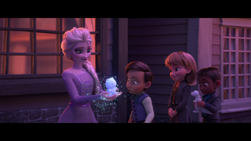
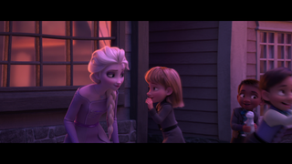
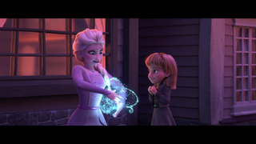

# "Sextant moments"

[TODO: Write an introduction.]

## Why "sextant"?

There's a brief moment in _Frozen II_ where Queen Elsa entertains some young
children by creating things for them. Just like a programmer, Elsa loves using
her special skills to benefit other people, especially those she cares about.
Some things she does are pretty easy and straight-forward.

_Elsa has made an ice dinosaur for one young lad, and creates a bear for another._

_A young girl has a special request: "Can you make a sextant?"_

_"A what? Errr.... I think so? Let me see what I can do..."_

Elsa's worried that she can't do justice to this request. What if it doesn't
work? What if it's not good enough? What if I disappoint her? I have to try...

_"I really don't know if this is going to work..."_

_Outwardly: "Here, I made this for you!"_
_Inwardly: "Oh please like it please like it please like it"_

_Moment of truth! It's being tried out for the first time._

_"Yes!! She likes it!!"_

Observe Elsa's facial expressions during this tiny moment - it's about six
seconds in the final movie - and remember that she's happy to do this, but
still wants to see that it's wanted. THAT is how I feel when I write custom
code for people.

## Specific sextant moments

I want to celebrate three very specific people and three specific moments.
Because I can.

### DeviCat and the Hype Train Tracker

* Who: [DeviCat](https://twitch.tv/devicat)
* What: [Hype train tracker](https://sikorsky.rosuav.com/hypetrain?for=devicat)
* Why: Because the native tracker, while good as far as it goes, isn't sufficient.

Devi not only accepted and welcomed the new tool, but actively helped me to figure
out what was going wrong with its audio alerts. Her patience was essential in this
project becoming what it was meant to be, and her appreciation for it made it all
worthwhile. Thank you.

### MaayaInsane's sub tracker

* Who: [MaayaInsane](https://twitch.tv/maayainsane)
* What: Sub tracker (https://gideon.rosuav.com/subtracker/ but not very useful to anyone else)
* Why: Because digging through a bunch of CSV files manually is a pain.

Maaya keeps track of a person's first-ever subscription (including receipt of a
gift sub) by downloading a CSV file of her subscribers every month. Before the
sub tracker, she had to guess at when someone had first subbed, then manually
search through the files, to find the right one. Error-prone and fiddly.

Maaya doesn't HAVE to tell everyone that she's using my tool. But she does, and
she is always enthusiastic about it. She was also patient with the various
iterations, including when the tool overdid its Heroku storage capacity and had
to be redirected to a new host. Maaya, thank you for being awesome.

### CassyDraws' sub point counter

* Who: [CassyDraws](https://twitch.tv/cassydraws)
* What: [Sub points display for OBS](https://sikorsky.rosuav.com/subpoints)
* Why: Because everything else was unreliable, or counted something different

This was built on top of existing infrastructure in my channel bot, so it wasn't
too hard to do. But the help that it gave Cassy far outweighed the effort, and
it's been of value to her. That's the most important thing: it is of value, and
she has said so. Thank you for being amazing, and I wish you all the best in your
push to partnership.

## How to make a geek feel great

Speak up! :) If you like something, say so. If you wish it could be a little bit
different, say so. If you have a crazy idea that might not even be posible, say
so! You never know what will be that bit of inspiration.
