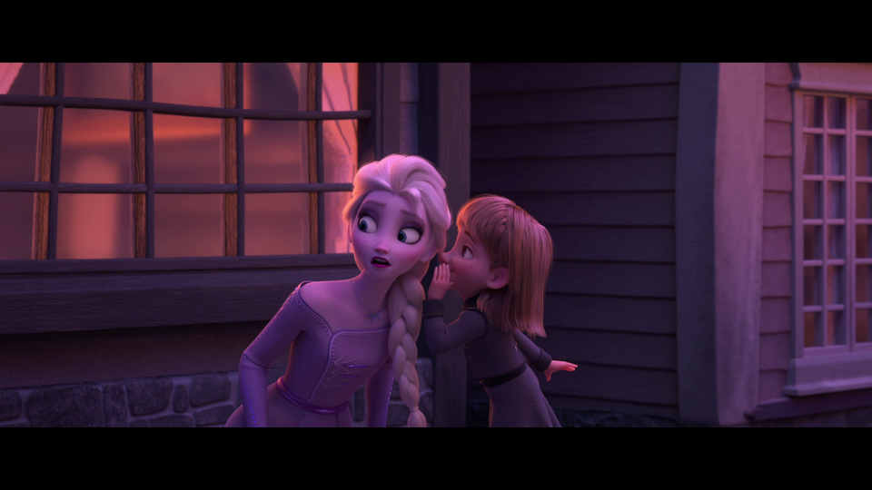
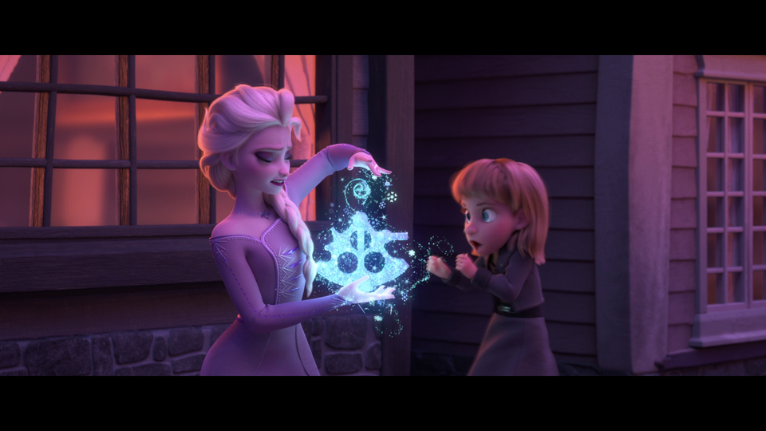
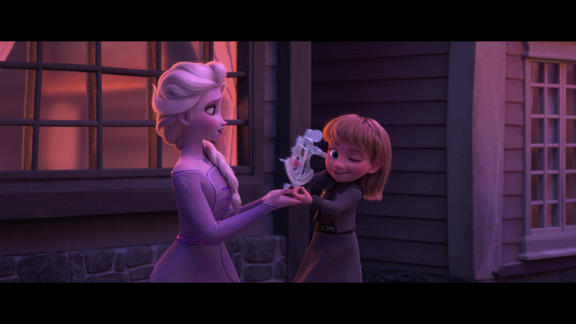
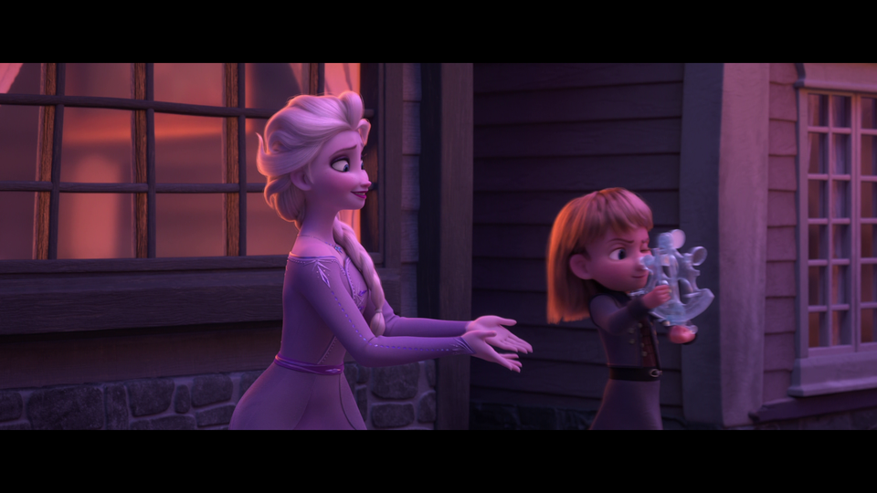

# "Sextant moments"

[TODO: Write an introduction.]

## Why "sextant"?

There's a brief moment in _Frozen II_ where Queen Elsa entertains some young
children by creating things for them. Just like a programmer, Elsa loves using
her special skills to benefit other people, especially those she cares about.
Some things she does are pretty easy and straight-forward.

Elsa has made an ice dinosaur for one young lad, and creates a bear for another.

A young girl has a special request: "Can you make a sextant?"

"A what? Errr.... I think so? Let me see what I can do..."

Elsa's worried that she can't do justice to this request. What if it doesn't
work? What if it's not good enough? What if I disappoint her? I have to try...

"I really don't know if this is going to work..."

Outwardly: "Here, I made this for you!"
Inwardly: "Oh please like it please like it please like it"

Moment of truth! It's being tried out for the first time.

"Yes!! She likes it!!"

Observe Elsa's facial expressions during this tiny moment - it's about six
seconds in the final movie - and remember that she's happy to do this, but
still wants to see that it's wanted. THAT is how I feel when I write custom
code for people.

